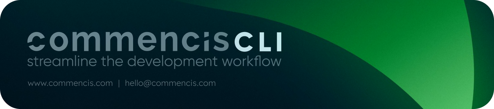

<picture>
  <source media="(max-width: 400px)" srcset="./assets/commencis-cli-logo-mobile.png">
  
</picture>

<h1 align="center">
  Commencis CLI

[](LICENSE)

</h1>

> [!WARNING]
> The Commencis CLI is actively under development. Further enhancements are on the way, and feedback and contributions are welcome!

The Commencis CLI serves as a comprehensive command-line interface for effortlessly creating and managing projects.

This tool generates carefully crafted starter templates designed by [Commencis](https://www.commencis.com/) to meet the needs of modern applications. With a focus on best practices and clean code, the Commencis CLI empowers developers to kickstart projects with confidence.

## For Contributors:

### Prerequisites

#### Node.js

Before you begin, ensure you have `node: >= 20.18` installed on your system.

#### pnpm

This project uses `pnpm: >= 9.12.2` as the package manager. You can install it either by activating with `corepack` which is the recommended way:

```bash
corepack prepare pnpm@latest --activate
corepack enable pnpm
```

or install globally on your system with npm.

```bash
npm install -g pnpm
```

### Installation

Run the following command to install project dependencies:

```bash
pnpm install
```

### Development

You can run the following command to start development environment:

```bash
pnpm run dev
```

## Contribution

We welcome contributions to improve this project. Feel free to open issues or pull requests to suggest enhancements or report any issues.

> [!IMPORTANT]
> For developers contributing to this project, it's important to familiarize yourself with these tools, as they are integral to the workflow and code quality standards.

## License

This project is licensed under the [Apache License 2.0](https://opensource.org/licenses/Apache-2.0) - see the [LICENSE](./LICENSE) file for details.

© [Commencis](https://www.commencis.com/), 2024. All rights reserved.
